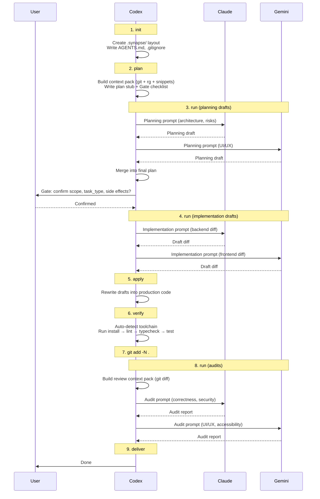

# Synapse Architecture

Technical documentation for contributors and advanced users.

<p align="center">
  <a href="ARCHITECTURE_CN.md">简体中文</a> | English
</p>

## Module Structure

```
.codex/skills/synapse/
├── SKILL.md                        # Skill manifest (trigger rules, routing, safety)
├── assets/
│   ├── defaults.json               # Configuration (timeouts, retries, limits, safety)
│   └── ui/
│       └── index.html              # Web viewer frontend (HTML/JS/CSS)
├── references/
│   ├── init.md                     # Per-command specification
│   ├── pack.md
│   ├── plan.md
│   ├── run.md
│   ├── verify.md
│   ├── ui.md
│   ├── workflow.md
│   └── feat.md
└── scripts/
    ├── synapse.py                  # CLI entry point (argparse → subcommands)
    └── _synapse/
        ├── __init__.py
        ├── common.py               # Shared utilities, WriteGuard, paths, slugify
        ├── state.py                # Plan file I/O, state.json, index.json
        ├── llm.py                  # External model runner (stream-json, retries)
        ├── context_pack.py         # Context pack builder (git, rg, snippets)
        ├── agents_md.py            # AGENTS.md / .gitignore management
        ├── cmd_init.py             # `synapse init`
        ├── cmd_pack.py             # `synapse pack`
        ├── cmd_plan.py             # `synapse plan`
        ├── cmd_run.py              # `synapse run`
        ├── cmd_verify.py           # `synapse verify` (orchestrator)
        ├── cmd_ui.py               # `synapse ui` (loads assets/ui/index.html)
        └── verify/
            ├── __init__.py
            ├── types.py            # VerifyStep, VerifyStepResult dataclasses
            ├── node.py             # Node.js detection (pnpm/yarn/npm)
            ├── python.py           # Python detection (pytest/unittest)
            ├── rust.py             # Rust detection (cargo)
            ├── golang.py           # Go detection (go test)
            └── dotnet.py           # .NET detection (dotnet test)
```

**Design constraint**: Pure Python standard library — no third-party dependencies.

---

## Execution Flow



---

## Document Hierarchy

| Document | Audience | Purpose |
|----------|----------|---------|
| `README.md` | Humans | Overview, quick start, FAQ |
| `ARCHITECTURE.md` | Contributors | Technical internals, all details |
| `SKILL.md` | Codex | Execution protocol, trigger rules, hard rules |
| `references/*.md` | Codex | Per-command specs (usage, writes, side effects) |

---

## Generated Artifacts

All artifacts are written under `<project_root>/.synapse/`:

```
.synapse/
├── state.json          # Last command, sessions, timestamps
├── index.json          # Plan index (slug, path, sessions)
├── plan/
│   └── <slug>.md       # Plan file (meta JSON + Gate checklist + drafts)
├── context/
│   └── <slug>-<phase>.md   # Context pack (git state + rg matches + file snippets)
├── prompts/
│   └── <ts>-<slug>-<phase>-<model>.prompt.md   # Rendered prompt (auditable)
├── patches/
│   ├── <ts>-<slug>-<phase>-<model>.md          # Model output (full text)
│   └── <ts>-<slug>-<phase>-<model>.diff        # Extracted unified diff (if any)
└── logs/
    ├── <ts>-<slug>-<phase>-<model>-stream.jsonl         # Stream-json log
    ├── <ts>-<slug>-<phase>-<model>-stream-attempt2.jsonl # Retry log
    └── <ts>-verify-<step-name>.log                       # Verify step output
```

---

## Safety Mechanisms

### WriteGuard

**Location**: `common.py:17-52`

All file writes pass through `WriteGuard`, which enforces:

1. Target must be within `project_root`
2. First path component must be in `allowed_write_roots`
3. Default allowed roots: `AGENTS.md`, `.gitignore`, `.synapse`
4. Configurable via `defaults.json → safety.allowed_write_roots`

Violation raises `SynapseError` (hard fail, not a warning).

### External Model Sandboxing

External models are invoked headlessly with restricted permissions:

| Model | CLI flags | Effect |
|-------|-----------|--------|
| Claude | `--permission-mode plan --tools "" --strict-mcp-config` | No file/tool access |
| Gemini | `--approval-mode default` | Tool attempts denied by policy |

Prompts are delivered via stdin. Models never receive direct filesystem access.

### Atomic JSON Writes

**Location**: `common.py:78-87`

`write_json_atomic` writes to a `.tmp` file first, then uses `os.replace` for atomic rename. Both the target and temp file are checked against WriteGuard.

---

## External Model Runner

**Location**: `llm.py`

### Process Lifecycle

1. Build CLI argv (model-specific flags)
2. Spawn subprocess with `stdin=PIPE, stdout=PIPE, stderr=PIPE`
3. Write prompt to stdin, close stdin
4. Read stdout/stderr via dedicated threads into `queue.Queue`
5. Main loop polls queues with 50ms timeout, checks deadline
6. On timeout: `proc.kill()` → 5s grace period → force break
7. Reap child process, join reader threads

### Stream-JSON Parsing

| Model | Output format | Extraction |
|-------|--------------|------------|
| Gemini | `{"role": "assistant", "content": "..."}` | Concatenate all `content` deltas |
| Claude | `{"result": "..."}` | Use last `result` value |

Session IDs are captured from `session_id` field in any JSON line.

### Retry Logic

**Location**: `llm.py:299-359`

- Configurable via `defaults.json → runner.retries` (default: 2)
- Exponential backoff with jitter: `base * 2^(attempt-1)`, capped at `max_seconds`
- Success condition: `exit_code == 0 AND output_text.strip() != ""`
- Each attempt gets its own log file (`-attemptN` suffix)

### Line Truncation

Lines exceeding `max_line_bytes` (default: 10MB) are truncated in both stdout and stderr. Truncation counts are tracked per-run.

---

## Context Pack Builder

**Location**: `context_pack.py`

Builds a markdown document containing project context for model prompts.

### Sections

1. **Git state** (if git repo): branch, HEAD, `git status --porcelain`, `git diff --stat`, `git diff` (truncated)
2. **ripgrep matches**: derived from query tokens (stop-word filtered) or explicit `--rg-query` overrides
3. **Key file snippets**: preferred project files (`package.json`, `pyproject.toml`, etc.) + git-dirty files + explicit `--include-file`

### Limits (from `defaults.json → context_pack`)

| Setting | Default | Purpose |
|---------|---------|---------|
| `rg.max_depth` | 25 | Max directory depth for rg |
| `rg.max_queries` | 10 | Max number of rg queries |
| `rg.max_matches_per_query` | 80 | Max matches per query |
| `rg.max_total_matches` | 200 | Global match cap |
| `rg.max_filesize` | 1M | Skip files larger than this |
| `snippets.max_files` | 20 | Max key files to include |
| `snippets.max_lines_per_file` | 160 | Lines per snippet |
| `snippets.max_bytes_per_file` | 20000 | Bytes per snippet |
| `git.diff_max_bytes` | 200000 | Max diff size |
| `git.diff_max_lines` | 2000 | Max diff lines |
| `git.status_max_lines` | 300 | Max status lines |

### Query Derivation

**Location**: `context_pack.py:20-75`

When no explicit `--rg-query` is provided, queries are derived from the request text:
- Tokenize on `[A-Za-z0-9_./:-]+` patterns (min length 3)
- Filter English and Chinese stop words
- Deduplicate, cap at `max_queries`
- Fallback: first 32 chars of raw query

---

## Verify Auto-Detection

**Location**: `cmd_verify.py` (orchestrator) + `verify/` subpackage (per-ecosystem detectors)

Detects project toolchain by marker files and generates verification steps. Each ecosystem has its own module under `verify/`, returning `list[VerifyStep]`. Shared types (`VerifyStep`, `VerifyStepResult`) live in `verify/types.py`.

| Ecosystem | Detection | Install | Test |
|-----------|-----------|---------|------|
| **Node** | `package.json` | `pnpm install` / `yarn install` / `npm ci` (by lockfile) | `lint`, `typecheck`, `test` scripts (if present) |
| **Python** | `pyproject.toml` or `requirements.txt` | `uv sync` or `uv venv` + `uv pip install` | `pytest` (if detected) or `unittest discover` |
| **Rust** | `Cargo.toml` | — | `cargo test` |
| **Go** | `go.mod` | — | `go test ./...` |
| **.NET** | `*.sln` / `*.csproj` / `*.fsproj` | — | `dotnet test` |

### Node Package Manager Selection

**Location**: `cmd_verify.py:69-76`

Priority: `pnpm-lock.yaml` → `yarn.lock` → `package-lock.json` → fallback `npm install`

### Pytest Detection

**Location**: `cmd_verify.py:89-103`

Uses pytest if any of: `pytest.ini`, `conftest.py`, `tests/` directory, or `"pytest"` appears in `pyproject.toml`.

### Options

| Flag | Effect |
|------|--------|
| `--dry-run` | Print planned commands without executing |
| `--no-install` | Skip dependency install steps |
| `--keep-going` | Continue after failures |

### Side Effects

`verify` may create project-local toolchain artifacts: lockfiles, `.venv/`, `node_modules/`, build outputs. This is expected and documented in the Gate checklist.

---

## Plan File Format

**Location**: `state.py:22-64`

Plan files are markdown with an embedded JSON meta block:

```markdown
# Plan: `<slug>`

## Synapse Meta

​```json
{
  "context_pack": "<path>",
  "created_at": "2026-02-07T12:00:00+00:00",
  "request": "...",
  "sessions": { "claude": "<session_id>", "gemini": "<session_id>" },
  "slug": "<slug>",
  "synapse_version": 1,
  "task_type": "fullstack"
}
​```

## Request
...

## Plan
...
```

The JSON meta block is parsed/updated via regex (`extract_json_meta` / `_replace_json_meta`). Session IDs are written back when `--plan-path` is provided to `synapse run`.

---

## State Management

**Location**: `state.py:91-136`

### `state.json`

Tracks the last command executed and all session IDs by slug:

```json
{
  "version": 1,
  "project_root": "...",
  "created_at": "...",
  "updated_at": "...",
  "last": { "command": "run", "model": "claude", "slug": "...", ... },
  "sessions": {
    "gemini": { "by_slug": { "<slug>": "<session_id>" } },
    "claude": { "by_slug": { "<slug>": "<session_id>" } }
  }
}
```

### `index.json`

Rebuilt on every command. Lists all plan files with their metadata:

```json
{
  "version": 1,
  "updated_at": "...",
  "plans": [
    { "slug": "...", "path": "...", "created_at": "...", "sessions": {} }
  ]
}
```

---

## Session Resume

### Capture

`run_model_once` captures `session_id` from the first stream-json line that contains it. The ID is stored in:
- `state.json → sessions.<model>.by_slug.<slug>`
- Plan file meta `sessions.<model>` (if `--plan-path` provided)

### Resume

CLI flags for resuming a previous session:

| Flag | Effect |
|------|--------|
| `--resume-gemini <ID>` | Pass `--resume <ID>` to Gemini CLI |
| `--resume-claude <ID>` | Pass `--resume <ID>` to Claude CLI |
| `--resume <ID>` | Back-compat alias for `--resume-gemini` |

If both `--resume` and `--resume-gemini` are provided with different values, Synapse errors.

---

## Prompt Template System

**Location**: `cmd_run.py:35-39`

Prompts are **not hardcoded** in scripts. Codex writes prompt files and passes them via `--prompt-file`. Template variables use `{{KEY}}` syntax:

- `--var KEY=VALUE` — inline replacement
- `--var-file KEY=PATH` — replace with file contents

Example: `--var REQUEST="Add auth" --var-file CONTEXT=.synapse/context/auth-plan.md`

---

## Web Viewer (`synapse ui`)

**Location**: `cmd_ui.py` + `assets/ui/index.html`

HTML/JS/CSS frontend is stored as a static asset (`assets/ui/index.html`) and loaded at import time via `_load_ui_html()`. Served via `http.server.ThreadingHTTPServer`.

### API Endpoints

| Endpoint | Response |
|----------|----------|
| `GET /` | HTML viewer |
| `GET /api/tree` | JSON listing of all `.synapse/` files by category |
| `GET /api/file?path=<rel>` | File contents (text, max 2MB, `.synapse/` only) |

### Security

- Only serves files under `.synapse/` (enforced by `_within_synapse` check)
- Absolute paths rejected
- Binds to `127.0.0.1` by default

### Views

- **Timeline**: Groups artifacts by `slug → phase → model`, sorted by timestamp
- **Browse**: Raw directory listing by category (state, plans, prompts, patches, context, logs)

---

## AGENTS.md Management

**Location**: `agents_md.py`

`synapse init` maintains a marked block in `AGENTS.md`:

```markdown
<!-- SYNAPSE-BEGIN -->
## Synapse
...
<!-- SYNAPSE-END -->
```

Behavior:
- If `AGENTS.md` doesn't exist: create with default template + Synapse block
- If markers exist: replace the block in-place
- If no markers: append the block

The `.gitignore` entry `/.synapse/` is similarly managed (idempotent append).

---

## Configuration (`defaults.json`)

**Location**: `assets/defaults.json`

```json
{
  "version": 1,
  "runner": {
    "timeout_seconds": 3600,
    "retries": 2,
    "retry_backoff": { "base_seconds": 2, "max_seconds": 30, "jitter": true },
    "stream_json": { "max_line_bytes": 10485760 }
  },
  "context_pack": {
    "rg": { "max_depth": 25, "max_queries": 10, "max_matches_per_query": 80, "max_total_matches": 200, "max_filesize": "1M" },
    "snippets": { "max_files": 20, "max_lines_per_file": 160, "max_bytes_per_file": 20000 },
    "git": { "diff_max_bytes": 200000, "diff_max_lines": 2000, "status_max_lines": 300 }
  },
  "safety": {
    "allowed_write_roots": ["AGENTS.md", ".gitignore", ".synapse"]
  }
}
```

---

## Exit Codes

| Command | `0` | `2` |
|---------|-----|-----|
| Most commands | Success | `SynapseError` |
| `synapse run` | `exit_code == 0` AND non-empty output | Otherwise |
| `synapse verify` | All steps OK (or nothing to run) | Any FAILED/BLOCKED step |

---

## Project Root Detection

**Location**: `common.py:139-148`

1. Run `git rev-parse --show-toplevel` from `--project-dir`
2. If successful: use git root as project root
3. If not a git repo: use `--project-dir` as-is

This means `--project-dir` can point to any subdirectory within a repo; `.synapse/` is always created at the repo root.

---

## Path Variables

| Variable | Meaning |
|----------|---------|
| `<skill_root>` | Synapse skill directory (contains `SKILL.md`) |
| `<project_root>` | Target project root (git root or `--project-dir`) |
| `<slug>` | Task identifier (derived from request or `--slug`) |
| `<ts>` | Timestamp (`YYYYMMDD-HHMMSS`) |
| `<phase>` | Workflow phase (`plan`, `run`, `review`, etc.) |
| `<model>` | `claude` or `gemini` |
