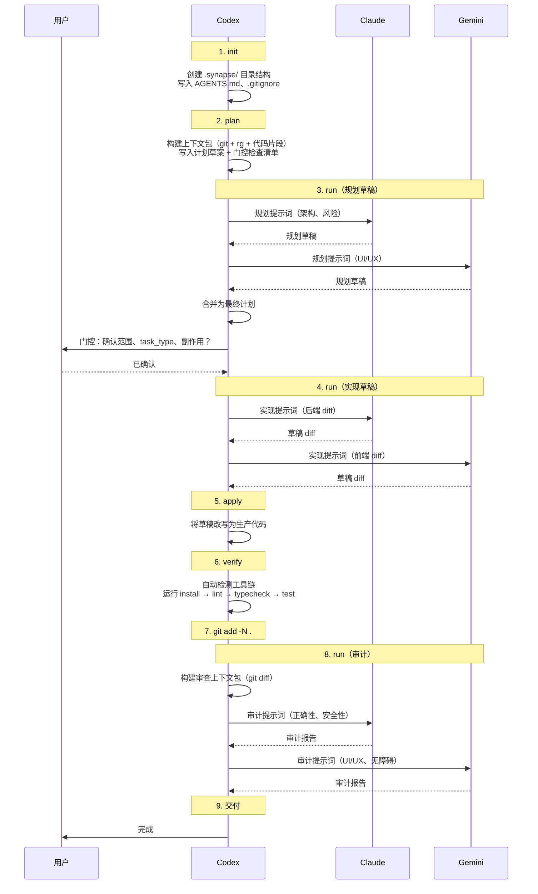

# Synapse 架构

面向贡献者和高级用户的技术文档。

<p align="center">
  简体中文 | <a href="ARCHITECTURE.md">English</a>
</p>

## 模块结构

```
.codex/skills/synapse/
├── SKILL.md                        # skill清单（触发规则、路由、安全）
├── assets/
│   ├── defaults.json               # 配置（超时、重试、限制、安全）
│   └── ui/
│       └── index.html              # Web 查看器前端（HTML/JS/CSS）
├── references/
│   ├── init.md                     # 各命令规格说明
│   ├── pack.md
│   ├── plan.md
│   ├── run.md
│   ├── verify.md
│   ├── ui.md
│   ├── workflow.md
│   └── feat.md
└── scripts/
    ├── synapse.py                  # CLI 入口（argparse → 子命令）
    └── _synapse/
        ├── __init__.py
        ├── common.py               # 共享工具、WriteGuard、路径、slugify
        ├── state.py                # 计划文件 I/O、state.json、index.json
        ├── llm.py                  # 外部模型运行器（stream-json、重试）
        ├── context_pack.py         # 上下文包构建器（git、rg、代码片段）
        ├── agents_md.py            # AGENTS.md / .gitignore 管理
        ├── cmd_init.py             # `synapse init`
        ├── cmd_pack.py             # `synapse pack`
        ├── cmd_plan.py             # `synapse plan`
        ├── cmd_run.py              # `synapse run`
        ├── cmd_verify.py           # `synapse verify`（编排器）
        ├── cmd_ui.py               # `synapse ui`（加载 assets/ui/index.html）
        └── verify/
            ├── __init__.py
            ├── types.py            # VerifyStep、VerifyStepResult 数据类
            ├── node.py             # Node.js 检测（pnpm/yarn/npm）
            ├── python.py           # Python 检测（pytest/unittest）
            ├── rust.py             # Rust 检测（cargo）
            ├── golang.py           # Go 检测（go test）
            └── dotnet.py           # .NET 检测（dotnet test）
```

**设计约束**：纯 Python 标准库 —— 无第三方依赖。

---

## 执行流程



---

## 文档层级

| 文档 | 受众 | 用途 |
|------|------|------|
| `README.md` | 用户 | 概览、快速开始、常见问题 |
| `ARCHITECTURE.md` | 贡献者 | 技术内部细节 |
| `SKILL.md` | Codex | 执行协议、触发规则、硬性规则 |
| `references/*.md` | Codex | 各命令规格（用法、写入、副作用） |

---

## 生成产物

所有产物写入 `<project_root>/.synapse/`：

```
.synapse/
├── state.json          # 最后执行的命令、会话、时间戳
├── index.json          # 计划索引（slug、路径、会话）
├── plan/
│   └── <slug>.md       # 计划文件（元数据 JSON + 门控检查清单 + 草稿）
├── context/
│   └── <slug>-<phase>.md   # 上下文包（git 状态 + rg 匹配 + 文件片段）
├── prompts/
│   └── <ts>-<slug>-<phase>-<model>.prompt.md   # 渲染后的提示词（可审计）
├── patches/
│   ├── <ts>-<slug>-<phase>-<model>.md          # 模型输出（全文）
│   └── <ts>-<slug>-<phase>-<model>.diff        # 提取的 unified diff（如有）
└── logs/
    ├── <ts>-<slug>-<phase>-<model>-stream.jsonl         # Stream-json 日志
    ├── <ts>-<slug>-<phase>-<model>-stream-attempt2.jsonl # 重试日志
    └── <ts>-verify-<step-name>.log                       # 验证步骤输出
```

---

## 安全机制

### WriteGuard

**位置**：`common.py:17-52`

所有文件写入都经过 `WriteGuard` 检查，强制执行：

1. 目标必须在 `project_root` 内
2. 第一级路径组件必须在 `allowed_write_roots` 中
3. 默认允许的根路径：`AGENTS.md`、`.gitignore`、`.synapse`
4. 可通过 `defaults.json → safety.allowed_write_roots` 配置

违规会抛出 `SynapseError`（硬失败，非警告）。

### 外部模型沙箱

外部模型以无头模式调用，权限受限：

| 模型 | CLI 参数 | 效果 |
|------|----------|------|
| Claude | `--permission-mode plan --tools "" --strict-mcp-config` | 无文件/工具访问权限 |
| Gemini | `--approval-mode default` | 工具调用被策略拒绝 |

提示词通过 stdin 传递。模型永远不会获得直接的文件系统访问权限。

### 原子 JSON 写入

**位置**：`common.py:78-87`

`write_json_atomic` 先写入 `.tmp` 文件，然后使用 `os.replace` 进行原子重命名。目标文件和临时文件都会经过 WriteGuard 检查。

---

## 外部模型运行器

**位置**：`llm.py`

### 进程生命周期

1. 构建 CLI argv（模型特定参数）
2. 使用 `stdin=PIPE, stdout=PIPE, stderr=PIPE` 启动子进程
3. 将提示词写入 stdin，关闭 stdin
4. 通过专用线程将 stdout/stderr 读入 `queue.Queue`
5. 主循环以 50ms 超时轮询队列，检查截止时间
6. 超时时：`proc.kill()` → 5 秒宽限期 → 强制退出
7. 回收子进程，join 读取线程

### Stream-JSON 解析

| 模型 | 输出格式 | 提取方式 |
|------|----------|----------|
| Gemini | `{"role": "assistant", "content": "..."}` | 拼接所有 `content` 增量 |
| Claude | `{"result": "..."}` | 使用最后一个 `result` 值 |

Session ID 从任意 JSON 行的 `session_id` 字段中捕获。

### 重试逻辑

**位置**：`llm.py:299-359`

- 可通过 `defaults.json → runner.retries` 配置（默认：2）
- 指数退避加抖动：`base * 2^(attempt-1)`，上限为 `max_seconds`
- 成功条件：`exit_code == 0 AND output_text.strip() != ""`
- 每次尝试有独立的日志文件（`-attemptN` 后缀）

### 行截断

超过 `max_line_bytes`（默认：10MB）的行在 stdout 和 stderr 中都会被截断。截断计数按运行跟踪。

---

## 上下文包构建器

**位置**：`context_pack.py`

构建包含项目上下文的 markdown 文档，用于模型提示词。

### 章节

1. **Git 状态**（如果是 git 仓库）：分支、HEAD、`git status --porcelain`、`git diff --stat`、`git diff`（截断）
2. **ripgrep 匹配**：从查询词（过滤停用词）或显式 `--rg-query` 覆盖中派生
3. **关键文件片段**：首选项目文件（`package.json`、`pyproject.toml` 等）+ git 脏文件 + 显式 `--include-file`

### 限制（来自 `defaults.json → context_pack`）

| 设置 | 默认值 | 用途 |
|------|--------|------|
| `rg.max_depth` | 25 | rg 最大目录深度 |
| `rg.max_queries` | 10 | 最大 rg 查询数 |
| `rg.max_matches_per_query` | 80 | 每个查询最大匹配数 |
| `rg.max_total_matches` | 200 | 全局匹配上限 |
| `rg.max_filesize` | 1M | 跳过大于此大小的文件 |
| `snippets.max_files` | 20 | 最大关键文件数 |
| `snippets.max_lines_per_file` | 160 | 每个片段的行数 |
| `snippets.max_bytes_per_file` | 20000 | 每个片段的字节数 |
| `git.diff_max_bytes` | 200000 | 最大 diff 大小 |
| `git.diff_max_lines` | 2000 | 最大 diff 行数 |
| `git.status_max_lines` | 300 | 最大 status 行数 |

### 查询派生

**位置**：`context_pack.py:20-75`

当未提供显式 `--rg-query` 时，从请求文本中派生查询：
- 按 `[A-Za-z0-9_./:-]+` 模式分词（最小长度 3）
- 过滤英文和中文停用词
- 去重，上限为 `max_queries`
- 回退：原始查询的前 32 个字符

---

## 验证自动检测

**位置**：`cmd_verify.py`（编排器）+ `verify/` 子包（各生态系统检测器）

通过标记文件检测项目工具链并生成验证步骤。每个生态系统在 `verify/` 下有独立模块，返回 `list[VerifyStep]`。共享类型（`VerifyStep`、`VerifyStepResult`）位于 `verify/types.py`。

| 生态系统 | 检测方式 | 安装 | 测试 |
|----------|----------|------|------|
| **Node** | `package.json` | `pnpm install` / `yarn install` / `npm ci`（按锁文件） | `lint`、`typecheck`、`test` 脚本（如存在） |
| **Python** | `pyproject.toml` 或 `requirements.txt` | `uv sync` 或 `uv venv` + `uv pip install` | `pytest`（如检测到）或 `unittest discover` |
| **Rust** | `Cargo.toml` | — | `cargo test` |
| **Go** | `go.mod` | — | `go test ./...` |
| **.NET** | `*.sln` / `*.csproj` / `*.fsproj` | — | `dotnet test` |

### Node 包管理器选择

**位置**：`cmd_verify.py:69-76`

优先级：`pnpm-lock.yaml` → `yarn.lock` → `package-lock.json` → 回退 `npm install`

### Pytest 检测

**位置**：`cmd_verify.py:89-103`

满足以下任一条件时使用 pytest：`pytest.ini`、`conftest.py`、`tests/` 目录，或 `pyproject.toml` 中包含 `"pytest"`。

### 选项

| 参数 | 效果 |
|------|------|
| `--dry-run` | 打印计划的命令但不执行 |
| `--no-install` | 跳过依赖安装步骤 |
| `--keep-going` | 失败后继续执行 |

### 副作用

`verify` 可能创建项目本地的工具链产物：锁文件、`.venv/`、`node_modules/`、构建输出。这是预期行为，已在门控检查清单中说明。

---

## 计划文件格式

**位置**：`state.py:22-64`

计划文件是包含嵌入式 JSON 元数据块的 markdown：

```markdown
# Plan: `<slug>`

## Synapse Meta

​```json
{
  "context_pack": "<path>",
  "created_at": "2026-02-07T12:00:00+00:00",
  "request": "...",
  "sessions": { "claude": "<session_id>", "gemini": "<session_id>" },
  "slug": "<slug>",
  "synapse_version": 1,
  "task_type": "fullstack"
}
​```

## Request
...

## Plan
...
```

JSON 元数据块通过正则表达式解析/更新（`extract_json_meta` / `_replace_json_meta`）。当提供 `--plan-path` 给 `synapse run` 时，session ID 会被写回。

---

## 状态管理

**位置**：`state.py:91-136`

### `state.json`

跟踪最后执行的命令和按 slug 分组的所有 session ID：

```json
{
  "version": 1,
  "project_root": "...",
  "created_at": "...",
  "updated_at": "...",
  "last": { "command": "run", "model": "claude", "slug": "...", ... },
  "sessions": {
    "gemini": { "by_slug": { "<slug>": "<session_id>" } },
    "claude": { "by_slug": { "<slug>": "<session_id>" } }
  }
}
```

### `index.json`

每次命令执行时重建。列出所有计划文件及其元数据：

```json
{
  "version": 1,
  "updated_at": "...",
  "plans": [
    { "slug": "...", "path": "...", "created_at": "...", "sessions": {} }
  ]
}
```

---

## 会话恢复

### 捕获

`run_model_once` 从第一个包含 `session_id` 的 stream-json 行中捕获。ID 存储在：
- `state.json → sessions.<model>.by_slug.<slug>`
- 计划文件元数据 `sessions.<model>`（如提供了 `--plan-path`）

### 恢复

用于恢复先前会话的 CLI 参数：

| 参数 | 效果 |
|------|------|
| `--resume-gemini <ID>` | 向 Gemini CLI 传递 `--resume <ID>` |
| `--resume-claude <ID>` | 向 Claude CLI 传递 `--resume <ID>` |
| `--resume <ID>` | `--resume-gemini` 的向后兼容别名 |

如果同时提供 `--resume` 和 `--resume-gemini` 且值不同，Synapse 会报错。

---

## 提示词模板系统

**位置**：`cmd_run.py:35-39`

提示词**不硬编码**在脚本中。Codex 编写提示词文件并通过 `--prompt-file` 传递。模板变量使用 `{{KEY}}` 语法：

- `--var KEY=VALUE` — 内联替换
- `--var-file KEY=PATH` — 用文件内容替换

示例：`--var REQUEST="Add auth" --var-file CONTEXT=.synapse/context/auth-plan.md`

---

## Web 查看器（`synapse ui`）

**位置**：`cmd_ui.py` + `assets/ui/index.html`

HTML/JS/CSS 前端作为静态资源存储（`assets/ui/index.html`），在导入时通过 `_load_ui_html()` 加载。通过 `http.server.ThreadingHTTPServer` 提供服务。

### API 端点

| 端点 | 响应 |
|------|------|
| `GET /` | HTML 查看器 |
| `GET /api/tree` | `.synapse/` 下所有文件的 JSON 分类列表 |
| `GET /api/file?path=<rel>` | 文件内容（文本，最大 2MB，仅 `.synapse/`） |

### 安全性

- 仅提供 `.synapse/` 下的文件（由 `_within_synapse` 检查强制执行）
- 拒绝绝对路径
- 默认绑定到 `127.0.0.1`

### 视图

- **时间线**：按 `slug → phase → model` 分组产物，按时间戳排序
- **浏览**：按类别的原始目录列表（state、plans、prompts、patches、context、logs）

---

## AGENTS.md 管理

**位置**：`agents_md.py`

`synapse init` 在 `AGENTS.md` 中维护一个标记块：

```markdown
<!-- SYNAPSE-BEGIN -->
## Synapse
...
<!-- SYNAPSE-END -->
```

行为：
- 如果 `AGENTS.md` 不存在：创建默认模板 + Synapse 块
- 如果标记存在：原地替换该块
- 如果无标记：追加该块

`.gitignore` 中的 `/.synapse/` 条目以类似方式管理（幂等追加）。

---

## 配置（`defaults.json`）

**位置**：`assets/defaults.json`

```json
{
  "version": 1,
  "runner": {
    "timeout_seconds": 3600,
    "retries": 2,
    "retry_backoff": { "base_seconds": 2, "max_seconds": 30, "jitter": true },
    "stream_json": { "max_line_bytes": 10485760 }
  },
  "context_pack": {
    "rg": { "max_depth": 25, "max_queries": 10, "max_matches_per_query": 80, "max_total_matches": 200, "max_filesize": "1M" },
    "snippets": { "max_files": 20, "max_lines_per_file": 160, "max_bytes_per_file": 20000 },
    "git": { "diff_max_bytes": 200000, "diff_max_lines": 2000, "status_max_lines": 300 }
  },
  "safety": {
    "allowed_write_roots": ["AGENTS.md", ".gitignore", ".synapse"]
  }
}
```

---

## 退出码

| 命令 | `0` | `2` |
|------|-----|-----|
| 大多数命令 | 成功 | `SynapseError` |
| `synapse run` | `exit_code == 0` 且输出非空 | 其他情况 |
| `synapse verify` | 所有步骤 OK（或无需运行） | 任何 FAILED/BLOCKED 步骤 |

---

## 项目根目录检测

**位置**：`common.py:139-148`

1. 从 `--project-dir` 运行 `git rev-parse --show-toplevel`
2. 如果成功：使用 git 根目录作为项目根目录
3. 如果不是 git 仓库：直接使用 `--project-dir`

这意味着 `--project-dir` 可以指向仓库内的任何子目录；`.synapse/` 始终创建在仓库根目录。

---

## 路径变量

| 变量 | 含义 |
|------|------|
| `<skill_root>` | Synapse skill目录（包含 `SKILL.md`） |
| `<project_root>` | 目标项目根目录（git 根目录或 `--project-dir`） |
| `<slug>` | 任务标识符（从请求或 `--slug` 派生） |
| `<ts>` | 时间戳（`YYYYMMDD-HHMMSS`） |
| `<phase>` | 工作流阶段（`plan`、`run`、`review` 等） |
| `<model>` | `claude` 或 `gemini` |
