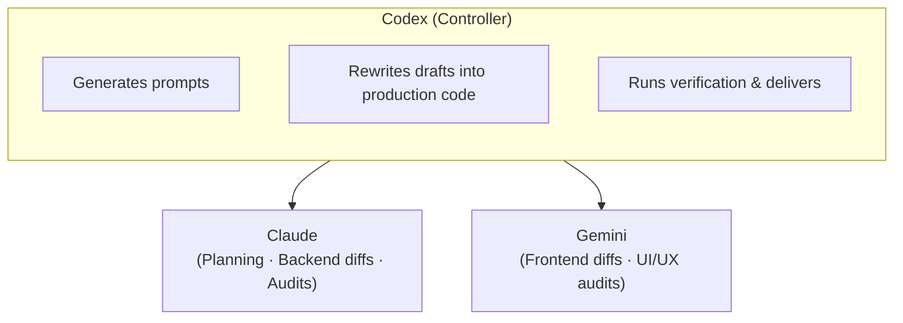

<h1 align="center">
Synapse
</h1>

<p align="center">
  <strong>Codex-Based Multi-Model Workflow</strong>
</p>

<p align="center">
  <strong>Multi-model AI meets production standards</strong><br/>
  <em>Draft by Claude & Gemini · Review by Codex · Deploy with confidence</em>
</p>

<p align="center">
  <a href="README_CN.md">简体中文</a> | English
</p>

---

## 🤔 What is this?

Synapse is a **Codex skill** that orchestrates multiple AI models to help you build software:



**Key principle**: External models (Claude/Gemini) only produce **drafts** — they never touch your files directly. Codex reviews every draft and rewrites it into production-quality code before applying.

---

## ✨ Core Features

| Feature | Description |
|---------|-------------|
| 📝 Draft-based | External models produce draft diffs; Codex applies final code |
| 🚪 Gate confirmation | Human approval required after planning, before execution |
| 🛡️ Write guard | All file writes are restricted to declared safe paths |
| ✅ Auto-verification | Detects your toolchain and runs lint/typecheck/test automatically |
| 🔄 Session resume | Pick up where you left off with captured session IDs |
| 🌐 Web viewer | Browse all artifacts locally via `synapse ui` |

---

## 🚀 Quick Start

### 📋 Prerequisites

| Tool | Required |
|------|----------|
| git | Recommended (enables review/audit via `git diff`) |
| rg (ripgrep) | Recommended (enables context pack search) |
| uv | Yes (Python runner) |
| claude CLI | Yes |
| gemini CLI | Yes |

### 💬 Usage (in Codex chat)

```powershell
# End-to-end workflow: init through review
synapse workflow "Add user authentication with JWT"

# Same thing, shorter alias
synapse feat "Add user authentication with JWT"
```

Codex automatically orchestrates the full pipeline: `init` → `plan` → Gate → `run` (drafts) → apply code → `verify` → `run` (audits) → deliver.

> **Note**: `workflow` and `feat` are Codex chat commands, not shell commands. You cannot run them directly via `python synapse.py workflow ...`.

### 🔧 Manual commands (advanced)

For debugging or reproducing individual steps:

```powershell
$Skill   = "<path-to>\.codex\skills\synapse"
$Project = "<your-project>"

# Initialize (idempotent)
uv run --no-project python "$Skill\scripts\synapse.py" --project-dir "$Project" init

# Create a plan
uv run --no-project python "$Skill\scripts\synapse.py" --project-dir "$Project" plan --task-type fullstack "Your request"

# Run an external model (prompt written by Codex)
uv run --no-project python "$Skill\scripts\synapse.py" --project-dir "$Project" run --model claude --phase plan --slug "<slug>" --prompt-file "<prompt>"

# Verify (auto-detects toolchain)
uv run --no-project python "$Skill\scripts\synapse.py" --project-dir "$Project" verify

# Open web viewer
uv run --no-project python "$Skill\scripts\synapse.py" --project-dir "$Project" ui
```

---

## 🔄 Workflow Overview

```
init → plan → run (gate_prep) → (Gate) → run (drafts) → Codex applies code → verify → run (audits) → deliver
                         │
                   Single confirmation
```

| Stage | What happens | Writes code |
|-------|-------------|:-----------:|
| init | Creates `.synapse/` layout, `AGENTS.md`, `.gitignore` | |
| plan | Generates plan stub + Gate checklist + context pack | |
| run (gate_prep) | Claude prepares a clarification checklist + acceptance criteria (Gemini optional for frontend) | |
| **Gate** | **User confirms scope, task type, side effects** | |
| run (drafts) | Claude/Gemini produce draft diffs | |
| apply | Codex rewrites drafts into production code | Yes |
| verify | Auto-detects toolchain, runs lint/typecheck/test | |
| run (audits) | Claude/Gemini review the final `git diff` | |

---

## 🤖 Model Roles

| Role | Codex (Controller) | Claude | Gemini |
|------|-------------------|--------|--------|
| Planning | Merges into final plan | Architecture, risks, tests | UI/UX, accessibility (frontend/fullstack only) |
| Drafting | Rewrites drafts to production code | Backend diffs (backend/fullstack) | Frontend diffs (frontend/fullstack) |
| Verification | Runs and interprets results | Not called | Not called |
| Auditing | Fixes code based on audits | Correctness, security, maintainability | UI/UX, accessibility (frontend/fullstack only) |

**Task type routing** (set at plan time):

- `frontend` — only frontend pipeline
- `backend` — only backend pipeline
- `fullstack` — both (default, higher cost)

---

## 🚪 Gate

The single required user confirmation. After `plan` (+ `gate_prep`), Codex presents:

- Clarification checklist (from Claude `gate_prep`) with recommended defaults (single-round reply)
- Scope and acceptance criteria
- `task_type` selection (with recommendation)
- Stack/toolchain choice
- Allowed side effects (dependency install, lockfiles, build artifacts)
- Git/review setup
- Verification plan

After Gate confirmation, the rest proceeds automatically.

---

## 📌 Git Best Practices

- **Use a git repo** — review/audit quality is best with `git diff`. Run `git init` if needed.
- **Commit after each feat** — keeps the next `git diff` clean and focused.
- **Before review** — run `git add -N .` so new untracked files appear in `git diff`.

---

## ❓ FAQ

<details>
<summary>Q: Why don't external models write code directly?</summary>

External models run headlessly with no auto-approve. Their output is treated as a draft. Codex rewrites it to match project conventions, adds tests, and ensures quality before applying.

</details>

<details>
<summary>Q: What does `synapse verify` actually run?</summary>

It auto-detects your toolchain (Node, Python, Rust, Go, .NET) and runs the appropriate install/lint/typecheck/test commands. Use `--dry-run` to preview without executing.

</details>

<details>
<summary>Q: Can I use only Claude or only Gemini?</summary>

Yes. Set `--task-type backend` (Claude only) or `--task-type frontend` (Gemini only). With `fullstack`, both are used.

</details>

<details>
<summary>Q: Where do artifacts go?</summary>

All artifacts are written to `.synapse/` in your project root (auto-added to `.gitignore`). Use `synapse ui` to browse them in a local web viewer.

</details>

---

## 📚 More Information

- [ARCHITECTURE.md](ARCHITECTURE.md) — Technical details, module structure, internal mechanisms
- `.codex/skills/synapse/SKILL.md` — Codex execution protocol
- `.codex/skills/synapse/references/*.md` — Per-command specifications

---

## 📄 License

MIT
