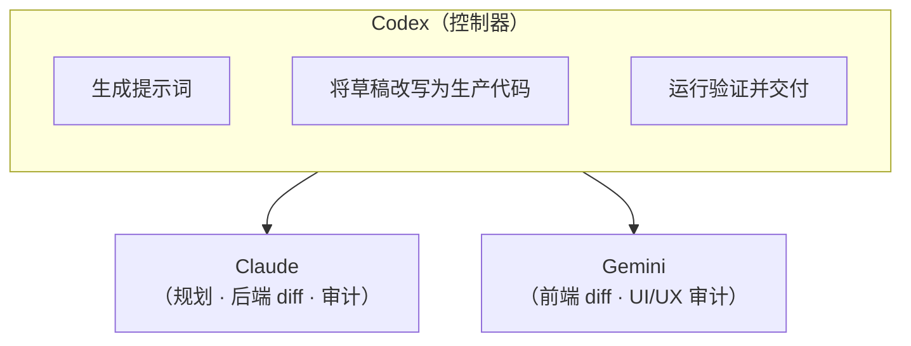

<h1 align="center">
Synapse
</h1>

<p align="center">
  <strong>基于 Codex 的多模型工作流</strong>
</p>

<p align="center">
  <strong>让多模型 AI 达到生产标准</strong><br/>
  <em>Claude & Gemini 起草 · Codex 审查 · 放心交付</em>
</p>

<p align="center">
  简体中文 | <a href="README.md">English</a>
</p>

---

## 🤔 这是什么？

Synapse 是一个 **Codex skill**，用于编排多个 AI 模型协助你构建软件：



**核心原则**：外部模型（Claude/Gemini）只产出**草稿** —— 它们不会直接修改你的文件。Codex 审查每份草稿，改写为生产级代码后再应用。

---

## ✨ 核心特性

| 特性 | 说明 |
|------|------|
| 📝 基于草稿 | 外部模型产出草稿 diff；Codex 负责最终代码 |
| 🚪 门控确认 | 规划完成后、执行前需人工审批 |
| 🛡️ 写入保护 | 所有文件写入限制在声明的安全路径内 |
| ✅ 自动验证 | 自动检测工具链并运行 lint/类型检查/测试 |
| 🔄 会话恢复 | 通过捕获的 session ID 继续上次工作 |
| 🌐 Web 查看器 | 通过 `synapse ui` 在本地浏览所有产物 |

---

## 🚀 快速开始

### 📋 前置条件

| 工具 | 是否必需 |
|------|----------|
| git | 推荐（启用基于 `git diff` 的审查/审计） |
| rg (ripgrep) | 推荐（启用上下文包搜索） |
| uv | 是（Python 运行器） |
| claude CLI | 是 |
| gemini CLI | 是 |

### 💬 使用方式（在 Codex 对话中）

```powershell
# 端到端工作流：从初始化到审查
synapse workflow "Add user authentication with JWT"

# 同样的功能，更短的别名
synapse feat "Add user authentication with JWT"
```

Codex 自动编排完整流水线：`init` → `plan` → 门控 → `run`（草稿）→ 应用代码 → `verify` → `run`（审计）→ 交付。

> **注意**：`workflow` 和 `feat` 是 Codex 对话命令，不是 shell 命令。不能直接通过 `python synapse.py workflow ...` 运行。

### 🔧 手动命令（高级）

用于调试或重现单个步骤：

```powershell
$Skill   = "<path-to>\.codex\skills\synapse"
$Project = "<your-project>"

# 初始化（幂等）
uv run --no-project python "$Skill\scripts\synapse.py" --project-dir "$Project" init

# 创建计划
uv run --no-project python "$Skill\scripts\synapse.py" --project-dir "$Project" plan --task-type fullstack "Your request"

# 运行外部模型（提示词由 Codex 编写）
uv run --no-project python "$Skill\scripts\synapse.py" --project-dir "$Project" run --model claude --phase plan --slug "<slug>" --prompt-file "<prompt>"

# 验证（自动检测工具链）
uv run --no-project python "$Skill\scripts\synapse.py" --project-dir "$Project" verify

# 打开 Web 查看器
uv run --no-project python "$Skill\scripts\synapse.py" --project-dir "$Project" ui
```

---

## 🔄 工作流概览

```
init → plan → run (gate_prep) → (门控) → run (草稿) → Codex 应用代码 → verify → run (审计) → 交付
                         │
                   单次确认
```

| 阶段 | 执行内容 | 写入代码 |
|------|----------|:--------:|
| init | 创建 `.synapse/` 目录结构、`AGENTS.md`、`.gitignore` | |
| plan | 生成计划草案 + 门控检查清单 + 上下文包 | |
| run（gate_prep） | Claude 生成澄清问题清单 + 验收标准（前端可选 Gemini） | |
| **门控** | **用户确认范围、任务类型、副作用** | |
| run（草稿） | Claude/Gemini 产出草稿 diff | |
| apply | Codex 将草稿改写为生产代码 | 是 |
| verify | 自动检测工具链，运行 lint/类型检查/测试 | |
| run（审计） | Claude/Gemini 审查最终 `git diff` | |

---

## 🤖 模型角色

| 角色 | Codex（控制器） | Claude | Gemini |
|------|----------------|--------|--------|
| 规划 | 合并为最终计划 | 架构、风险、测试 | UI/UX、无障碍（仅前端/全栈） |
| 草稿 | 改写草稿为生产代码 | 后端 diff（后端/全栈） | 前端 diff（前端/全栈） |
| 验证 | 运行并解读结果 | 不参与 | 不参与 |
| 审计 | 根据审计修复代码 | 正确性、安全性、可维护性 | UI/UX、无障碍（仅前端/全栈） |

**任务类型路由**（在规划时设定）：

- `frontend` — 仅前端流水线
- `backend` — 仅后端流水线
- `fullstack` — 两者都用（默认，成本更高）

---

## 🚪 门控

唯一需要用户确认的环节。`plan`（+ `gate_prep`）完成后，Codex 会展示：

- 澄清问题清单（来自 Claude `gate_prep`，单轮回复；未回答的项使用推荐默认值）
- 范围和验收标准
- `task_type` 选择（附推荐）
- 技术栈/工具链选择
- 允许的副作用（依赖安装、锁文件、构建产物）
- Git/审查设置
- 验证计划

门控确认后，后续步骤自动执行。

---

## 📌 Git 最佳实践

- **使用 git 仓库** — 基于 `git diff` 的审查/审计效果最佳。如需要请运行 `git init`。
- **每次 feat 后提交** — 保持下次 `git diff` 干净且聚焦。
- **审查前** — 运行 `git add -N .` 使新的未跟踪文件出现在 `git diff` 中。

---

## ❓ 常见问题

<details>
<summary>Q：为什么外部模型不直接写代码？</summary>

外部模型以无头模式运行，不自动批准任何操作。它们的输出被视为草稿。Codex 将其改写以匹配项目规范，添加测试，确保质量后再应用。

</details>

<details>
<summary>Q：`synapse verify` 实际运行什么？</summary>

它自动检测你的工具链（Node、Python、Rust、Go、.NET）并运行相应的安装/lint/类型检查/测试命令。使用 `--dry-run` 可预览而不执行。

</details>

<details>
<summary>Q：可以只用 Claude 或只用 Gemini 吗？</summary>

可以。设置 `--task-type backend`（仅 Claude）或 `--task-type frontend`（仅 Gemini）。使用 `fullstack` 时两者都会参与。

</details>

<details>
<summary>Q：产物存放在哪里？</summary>

所有产物写入项目根目录下的 `.synapse/`（自动添加到 `.gitignore`）。使用 `synapse ui` 可在本地 Web 查看器中浏览。

</details>

---

## 📚 更多信息

- [ARCHITECTURE_CN.md](ARCHITECTURE_CN.md) — 技术细节、模块结构、内部机制
- `.codex/skills/synapse/SKILL.md` — Codex 执行协议
- `.codex/skills/synapse/references/*.md` — 各命令规格说明

---

## 📄 许可证

MIT
